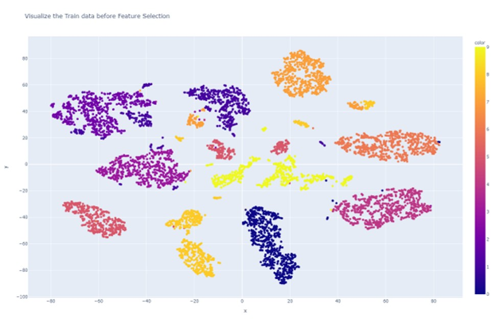
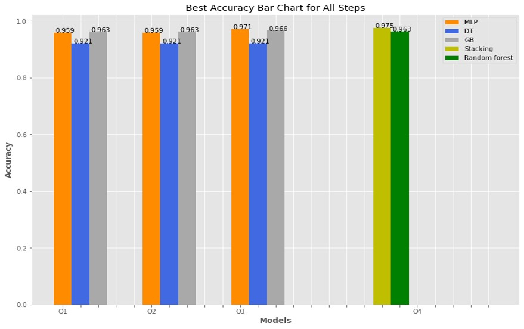

## Pen-Based-Recognition

The data is about the recognition of handwritten numbers from 0 to 9. There are 30 writers in the training dataset and each participant are asked to write 250 digits in random order. Without missing data, this dataset has 7494 observations. The researcher considers spatial resampling. Thus, for each digit, eight pairs of 2 dimensional (x axis and y axis) locations are recorded, which makes this dataset have 16 dimensional predictor variables.  

The link for the dataset http://archive.ics.uci.edu/ml/datasets/pen-based+recognition+of+handwritten+digits  

T-Distributed Stochastic Neighbouring Entities (t-SNE) Visulaization for the training dataset: 

The dataset was tested on 4 different models: MLP, Gradient Boost, Random Forest, and Decision Tree. In addition to, Stacking strategy which improved performance and outperformed the accuracy of the 3 models after improvement.  
To imporove the models performace feature selection was applied and Hyperparameters.  
Best accuracy achieved by stacking and MLP.

